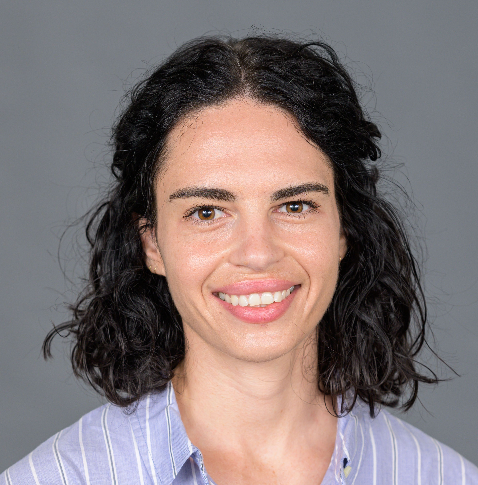

```{=html}
<main class="site-frame home-page">
  <section class="intro">
    <div class="intro-identity">
      <div class="intro-heading">
        <p class="small-label">Hello, I’m</p>
        <h1>Sabina Stefan Oller</h1>
        <p class="intro-role">Machine learning scientist and computational biologist.</p>
      </div>
      <figure class="portrait-wrap">
        
      </figure>
    </div>
    <div class="intro-copy">
      <p>I’m a machine learning scientist and computational biologist developing AI methods for complex biomedical data. My work spans multimodal and self-supervised learning, with applications ranging from therapeutic discovery to precision medicine. I’m particularly interested in building models that can integrate diverse biological data, generalize across datasets and model systems, and produce insights that are both predictive and biologically meaningful.</p>
      <p>I’m currently a Research Fellow at <a href="https://www.dana-farber.org/">Dana-Farber Cancer Institute</a>, with affiliations at Harvard Medical School and the Broad Institute.</p>
      <nav class="profile-links" aria-label="Profile links">
        <a href="mailto:sabinastefanoller@gmail.com">Email</a>
        <a href="https://github.com/sstefan01">GitHub</a>
        <a href="https://scholar.google.com/citations?user=0oB4VnYAAAAJ">Google Scholar</a>
        <a href="https://www.linkedin.com/in/sabina-stefan-2a9163a3">LinkedIn</a>
        <a href="assets/Sabina_Stefan_Oller_CV_Data_Science.pdf" download>CV</a>
      </nav>
    </div>
  </section>

  <section class="home-section" aria-labelledby="selected-work-heading">
    <h2 id="selected-work-heading">Selected work</h2>

    <article class="work-item">
      <div class="work-meta">Current research</div>
      <div>
        <h3><a href="research.html#multimodal-ai">Multimodal AI for therapeutic discovery</a></h3>
        <p>I am developing representation-learning methods that connect tumor molecular profiles, functional-genomic perturbations, and pharmacologic data to predict cancer dependencies and prioritize therapeutic targets.</p>
        <p class="quiet-links">multimodal learning · self-supervised learning · functional genomics</p>
      </div>
    </article>

    <article class="work-item">
      <div class="work-meta">Featured project</div>
      <div>
        <h3><a href="research.html#mantis">MANTIS</a></h3>
        <p class="project-full-name">Methylation profiling and Artificial Neural networks for Time-resolved Individualized Survival predictions</p>
        <p>A multimodal, biologically guided deep-learning framework that integrates DNA methylation, copy-number, survival, and clinical information for individualized outcome and treatment-effect prediction in childhood brain tumors.</p>
        <p class="quiet-links"><a href="https://github.com/sstefan01/methylation-survival">code</a> · <a href="https://academic.oup.com/neuro-onc-peds/article/2/Supplement_1/wuag026.364/8714939">abstract</a></p>
      </div>
    </article>

    <article class="work-item">
      <div class="work-meta">Earlier research</div>
      <div>
        <h3><a href="research.html#earlier-work">Quantitative biomedical imaging</a></h3>
        <p>Deep learning, simulation, and image-analysis methods for measuring and longitudinally tracking cerebral microvascular structure and function.</p>
        <p class="quiet-links"><a href="research.html#earlier-work">View the complete set of earlier projects →</a></p>
      </div>
    </article>
  </section>

  <section class="home-section short-bio" aria-labelledby="background-heading">
    <h2 id="background-heading">Background</h2>
    <div class="bio-columns">
      <p>I completed my PhD in Biomedical Engineering at Brown University, where I worked at the intersection of deep learning and quantitative optical imaging. Before that, I studied bioinformatics, physics, and applied mathematics at the University of Cape Town.</p>
      <p>Outside research, I enjoy Brazilian jiu-jitsu and spending time with my dog. I am based in Boston.</p>
    </div>
    <p class="section-link"><a href="assets/Sabina_Stefan_Oller_CV_Data_Science.pdf" download>Download my CV →</a></p>
  </section>

  <section class="home-section contact-note" aria-labelledby="contact-heading">
    <h2 id="contact-heading">Get in touch</h2>
    <p>I am always happy to talk about machine learning for biological discovery, research collaborations, or relevant research and industry opportunities.</p>
    <p><a href="mailto:sabinastefanoller@gmail.com">sabinastefanoller@gmail.com</a></p>
  </section>
</main>
```
